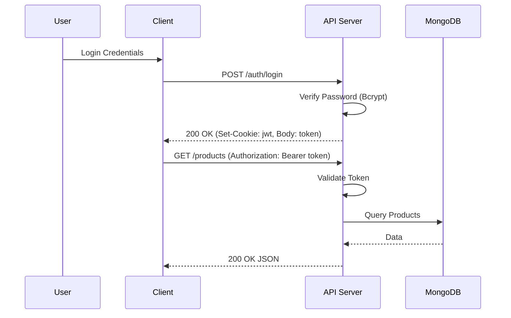
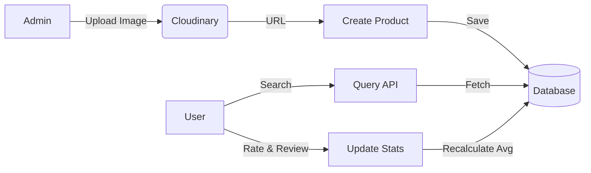

# E-Commerce Backend API 

> **Production-Ready RESTful API with TypeScript, Node.js, and MongoDB.**

[](https://github.com/yourusername/project)
[](./TECHNICAL_DOCUMENTATION.md)
[](./API_DOCUMENTATION.md)

##  Table of Contents
- [Overview](#-overview)
- [System Architecture](#%EF%B8%8F-system-architecture)
- [Project Workflow](#-project-workflow)
- [Getting Started](#-getting-started)
- [Project Structure](#-project-structure)
- [Features](#-features)

##  Overview
This project is a high-performance backend system designed for scalable e-commerce applications. It implements advanced features like **Dual-token Authentication**, **Role-Based Access Control**, and **Cloud-Native Media Management**.

**Key Documentation:**
-  [Technical Report & Architecture](./TECHNICAL_DOCUMENTATION.md) - Deep dive into design patterns and security.
-  [API Reference](./API_DOCUMENTATION.md) - List of all endpoints and usage.
-  [Project Report](./PROJECT_REPORT.pdf) - Detailed project overview and implementation details.

##  System Architecture

### Authentication Flow (Secure)
Requests are secured using short-lived JWTs and HttpOnly cookies.



##  Project Workflow

### Product Lifecycle
From creation by Admin to review by User.



##  Getting Started

### Prerequisites
- Node.js (v18+)
- MongoDB (Local or Atlas)
- Cloudinary Account (for images)
- SMTP Server (for emails)

### Installation

1.  **Clone & Install**:
    ```bash
    npm install
    ```

2.  **Environment Setup**:
    Copy `.env.example` to `.env` and fill in your credentials.
    ```bash
    cp .env.example .env
    ```

3.  **Run Locally**:
    ```bash
    npm run dev
    ```

4.  **Build for Production**:
    ```bash
    npm run build
    npm start
    ```

##  Project Structure

```bash
src/
├── config/         # Configuration (DB, Cloudinary)
├── constants/      # Static values (Messages, Cookie Options)
├── controllers/    # Request Handlers (Auth, Product)
├── middlewares/    # Interceptors (Auth, Upload, Security)
├── models/         # Mongoose Schemas
├── routes/         # API Endpoint Definitions
├── services/       # Business Logic
├── types/          # TypeScript Interfaces
├── utils/          # Helpers (AppError, catchAsync)
├── app.ts          # App configuration & Middleware
└── server.ts       # Server entry point
```

##  Features

-   **Authentication**: JWT-based auth with Access and Refresh tokens.
-   **Authorization**: Role-based access control (Admin, Customer).
-   **Products**: CRUD operations with pagination, filtering, sorting, and search.
-   **Security**: Helmet, CORS, Rate Limiting, Data Sanitization (Zod).
-   **Media**: Image uploads via Cloudinary.
-   **Communication**: Email notifications for password resets.

---
*Generated by Antigravity*
